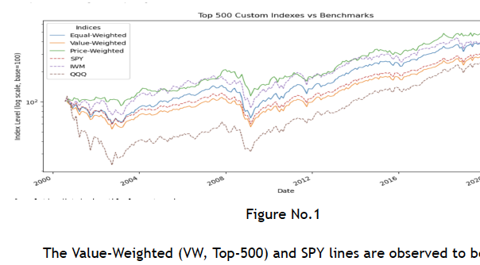

# US-Stock-Index-Lab
A from-scratch implementation of three distinct US equity indices, constructed using monthly CRSP data sourced from the WRDS database spanning two decades (2000–2020).

The project explores how index-weighting methodology shapes portfolio performance — and validates each custom index against widely-traded ETFs.
What this project does:
1. Data Extraction
Retrieves monthly price, return, and shares outstanding data for all US common stocks listed on the NYSE, AMEX, and NASDAQ exchanges.
2. Data Cleaning
Addresses survivorship bias by integrating delisting return data with the primary stock file to compute a more accurate "effective return" for each security.
3. Index Construction
Three separate Top-500 indices (ranked by market cap, rebalanced monthly) are built using different weighting schemes:

Value-Weighted (VW): Proportional to market capitalization — mirrors the S&P 500 methodology
Equal-Weighted (EW): Each of the 500 stocks carries an identical 0.2% allocation
Price-Weighted (PW): Proportional to share price — mirrors the Dow Jones methodology

4. Benchmarking
Each custom index is plotted alongside real-world ETF benchmarks — SPY, IWM, and QQQ — for direct performance comparison.
5. Validation
A time-series plot and correlation matrix confirm model accuracy — the custom VW index achieves a 0.996 correlation with SPY.
